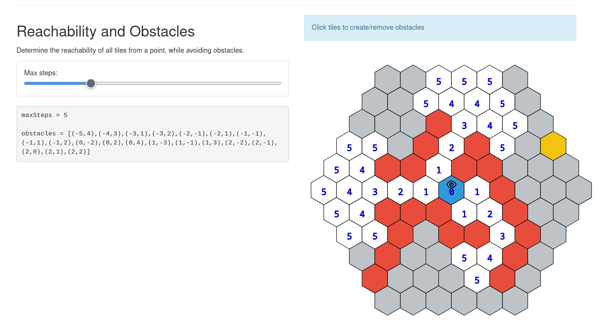

# elm-hex-grid

A simple library for building, managing, and pathfinding around hex grids in Elm.

Interactive Demo: [https://www.danneu.com/elm-hex-grid/](https://www.danneu.com/elm-hex-grid/)

## Development

Install dependencies:

    npm install

Run locally (with hot-reload via Vite):

    npm run dev

Preview the production build locally:

    npm run preview

Formatting helpers:

    npm run format        # runs both Elm and Prettier formatters
    npm run format:elm    # run elm-format on `src/`
    npm run format:prettier# format README.md with Prettier
